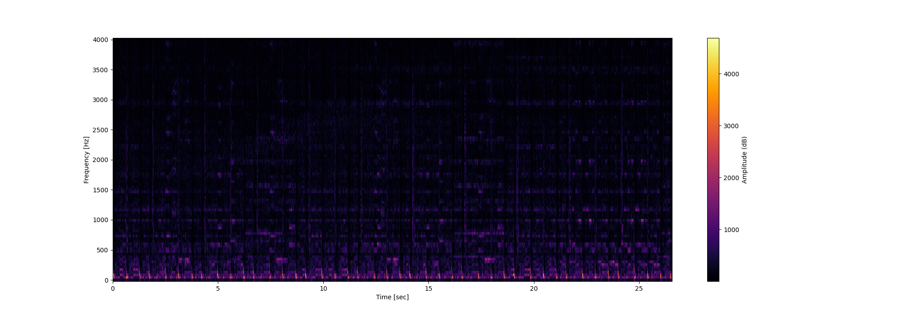

# Deep-Audio-Embedding

Visualizing the structure of audio in 3D using deep convolutional autoencoders. The code ultimately transforms .wav audio files into a timeseries in 3 dimensions.

See my [blog post](https://m-lin-dm.github.io/Deep_audio_embedding/) for a detailed description of this project.

## Guide

### 1. Convert a .wav file to spectrogram and save variables

1. Open [Save-dataset_2sec-window.py](Save-dataset_2sec-window.py)
2. (Optional) Change `dataset` value
3. In your terminal, run `python Save-dataset_2sec-window.py`

**Expected result**

- `[dataset]/variables/vars.npz` gets modified
- Spectrogram is created (See blow)



### 2. Build and train model on the audio from step one

You'll need a `wanb` account for this one

1. Open [Train_model_2sec-window](Train_model_2sec-window)
2. (Optional) Change `dataset` value
3. Add your `wandb` username for `entity`
4. In your terminal, run `python Train_model_2sec-window.py`

Keep hitting this issue when running `python Train_model_2sec-window.py`:

```bash
dt: 1
WARNING:absl:At this time, the v2.11+ optimizer `tf.keras.optimizers.Adam` runs slowly on M1/M2 Macs, please use the legacy Keras optimizer instead, located at `tf.keras.optimizers.legacy.Adam`.
WARNING:absl:There is a known slowdown when using v2.11+ Keras optimizers on M1/M2 Macs. Falling back to the legacy Keras optimizer, i.e., `tf.keras.optimizers.legacy.Adam`.
wandb: WARNING The save_model argument by default saves the model in the HDF5 format that cannot save custom objects like subclassed models and custom layers. This behavior will be deprecated in a future release in favor of the SavedModel format. Meanwhile, the HDF5 model is saved as W&B files and the SavedModel as W&B Artifacts.
Epoch 1/7
Traceback (most recent call last):
  File "/Users/dan/sites/Deep-Audio-Embedding/Train_model_2sec-window.py", line 212, in <module>
    model.fit(ds_train,
  File "/Users/dan/sites/Deep-Audio-Embedding/venv/lib/python3.10/site-packages/keras/src/utils/traceback_utils.py", line 70, in error_handler
    raise e.with_traceback(filtered_tb) from None
  File "/var/folders/zk/rdlvkcw54xncz2mg40zl9jf40000gn/T/__autograph_generated_filet2vgaa_p.py", line 15, in tf__train_function
    retval_ = ag__.converted_call(ag__.ld(step_function), (ag__.ld(self), ag__.ld(iterator)), None, fscope)
  File "/var/folders/zk/rdlvkcw54xncz2mg40zl9jf40000gn/T/__autograph_generated_filee5ai3ye8.py", line 23, in tf__call
    (loss, off_center_loss, reconstruction_loss, forcasting_loss, curvature_loss) = ag__.converted_call(ag__.ld(self).compute_loss, (ag__.ld(layer_inputs),), None, fscope)
  File "/var/folders/zk/rdlvkcw54xncz2mg40zl9jf40000gn/T/__autograph_generated_filelia2ioom.py", line 12, in tf__compute_loss
    reconstruction_loss = ag__.converted_call(ag__.ld(keras).metrics.binary_crossentropy, (ag__.converted_call(ag__.ld(K).flatten, (ag__.ld(x_i_),), None, fscope), ag__.converted_call(ag__.ld(K).flatten, (ag__.ld(x_i_hat_),), None, fscope)), None, fscope)
ValueError: in user code:

    File "/Users/dan/sites/Deep-Audio-Embedding/venv/lib/python3.10/site-packages/keras/src/engine/training.py", line 1338, in train_function  *
        return step_function(self, iterator)
    File "/Users/dan/sites/Deep-Audio-Embedding/venv/lib/python3.10/site-packages/keras/src/engine/training.py", line 1322, in step_function  **
        outputs = model.distribute_strategy.run(run_step, args=(data,))
    File "/Users/dan/sites/Deep-Audio-Embedding/venv/lib/python3.10/site-packages/keras/src/engine/training.py", line 1303, in run_step  **
        outputs = model.train_step(data)
    File "/Users/dan/sites/Deep-Audio-Embedding/venv/lib/python3.10/site-packages/keras/src/engine/training.py", line 1080, in train_step
        y_pred = self(x, training=True)
    File "/Users/dan/sites/Deep-Audio-Embedding/venv/lib/python3.10/site-packages/keras/src/utils/traceback_utils.py", line 70, in error_handler
        raise e.with_traceback(filtered_tb) from None
    File "/var/folders/zk/rdlvkcw54xncz2mg40zl9jf40000gn/T/__autograph_generated_filee5ai3ye8.py", line 23, in tf__call
        (loss, off_center_loss, reconstruction_loss, forcasting_loss, curvature_loss) = ag__.converted_call(ag__.ld(self).compute_loss, (ag__.ld(layer_inputs),), None, fscope)
    File "/var/folders/zk/rdlvkcw54xncz2mg40zl9jf40000gn/T/__autograph_generated_filelia2ioom.py", line 12, in tf__compute_loss
        reconstruction_loss = ag__.converted_call(ag__.ld(keras).metrics.binary_crossentropy, (ag__.converted_call(ag__.ld(K).flatten, (ag__.ld(x_i_),), None, fscope), ag__.converted_call(ag__.ld(K).flatten, (ag__.ld(x_i_hat_),), None, fscope)), None, fscope)

    ValueError: Exception encountered when calling layer 'add_model_loss' (type Add_model_loss).

    in user code:

        File "/Users/dan/sites/Deep-Audio-Embedding/Train_model_2sec-window.py", line 177, in call  *
            loss, off_center_loss, reconstruction_loss, forcasting_loss, curvature_loss = self.compute_loss(layer_inputs)
        File "/Users/dan/sites/Deep-Audio-Embedding/Train_model_2sec-window.py", line 162, in compute_loss  *
            reconstruction_loss = keras.metrics.binary_crossentropy(K.flatten(x_i_), K.flatten(x_i_hat_))  # The binary cross entropy averaged over all pixels should have a value around ~ 0.5-2 when model untrained
        File "/Users/dan/sites/Deep-Audio-Embedding/venv/lib/python3.10/site-packages/keras/src/losses.py", line 2432, in binary_crossentropy
            backend.binary_crossentropy(y_true, y_pred, from_logits=from_logits),
        File "/Users/dan/sites/Deep-Audio-Embedding/venv/lib/python3.10/site-packages/keras/src/backend.py", line 5817, in binary_crossentropy
            bce = target * tf.math.log(output + epsilon())

        ValueError: Dimensions must be equal, but are 16544 and 66176 for '{{node model/add_model_loss/mul}} = Mul[T=DT_FLOAT](model/add_model_loss/Reshape, model/add_model_loss/Log)' with input shapes: [16544], [66176].


    Call arguments received by layer 'add_model_loss' (type Add_model_loss):
      • layer_inputs=['tf.Tensor(shape=(8, 3), dtype=float32)', 'tf.Tensor(shape=(8, 3), dtype=float32)', 'tf.Tensor(shape=(8, 22, 94), dtype=float32)', 'tf.Tensor(shape=(8, 88, 94), dtype=float32)', 'tf.Tensor(shape=(8, 3), dtype=float32)', 'tf.Tensor(shape=(8, 45, 3), dtype=float32)']
```
